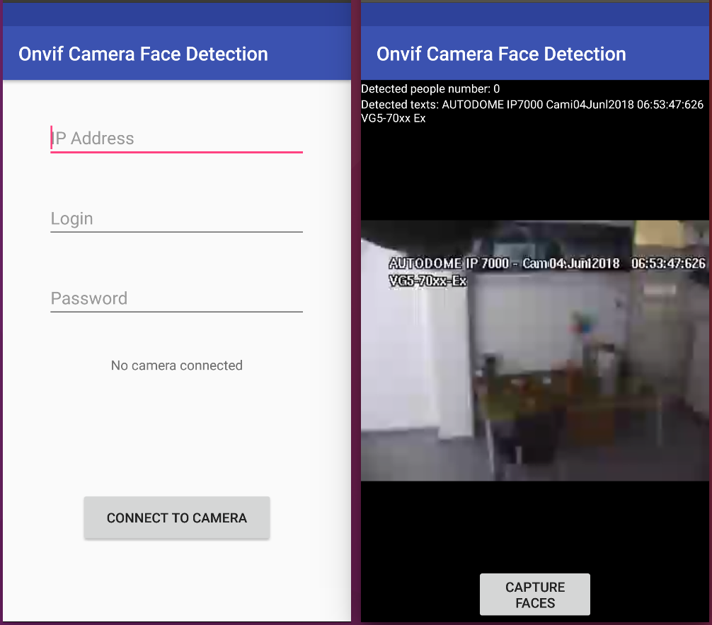

# Open Source Spotlight Challenge
Origins: https://github.com/rvi/ONVIFCameraAndroid\

Example on how to connect to an ONVIF camera on Android and use google mobile vision api for face detection and text recognition.

## Steps:
- Firstly application asks for write permission to save images. Touch on "ok".
- Touch on "Allow" to grant write permission.
- Fill login page with corresponding ip address and credentials and touch on "CONNECT TO CAMERA" and wait until "PLAY STREAM" will appear. Touch on "PLAY STREAM".
- You are now connected to the ONVIF camera. In the top there is a people counter and detected texts. In the bottom there is a button by touching which captures current image and faces.